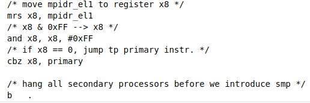
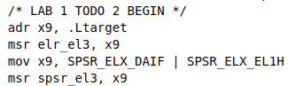
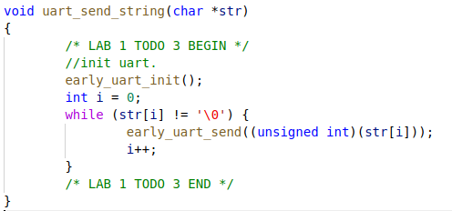
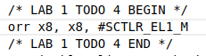
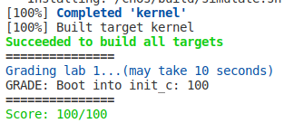

# `OS-2023-LAB1`实验报告

- **思考题 1**：阅读 `_start` 函数的开头，尝试说明` ChCore` 是如何让其中一个核首先进入初始化流程，并让其他核暂停执行的。提示：可以在 [Arm Architecture Reference Manual](https://documentation-service.arm.com/static/61fbe8f4fa8173727a1b734e) 找到 `mpidr_el1` 等系统寄存器的详细信息。

  **回答：**首先通过`mrs x8, mpidr_el1`指令将`mpidr_el1`寄存器移动到`x8`中，之后去除`x8`的低地址的第一个`byte`,而之后的`cdz`的指令会在`x8`的数值为0的时候才会跳转到`primary`指令处。而通过文档可以知道，`mpidr_el1`的低地址代表的是不同的核的级别`affinity level`,并且只有一个`core`的`affinity level`为0，所以可以通过这种方式来控制当前运行的`core`只有一个，并且其他的核无法运行。

  

- **练习题 2**：在 `arm64_elX_to_el1` 函数的 `LAB 1 TODO 1` 处填写一行汇编代码，获取 CPU 当前异常级别。提示：通过 `CurrentEL` 系统寄存器可获得当前异常级别。通过 `GDB` 在指令级别单步调试可验证实现是否正确。

  **回答**：填写的代码如下。即将表示异常级别的`CURRENTEL`寄存器移动到另一个寄存器中，而根据后续代码，可以知道应该是移动到`x9`寄存器中。

  > mrs x9, CURRENTEL

- **练习题 3**：在 `arm64_elX_to_el1` 函数的 `LAB 1 TODO 2` 处填写大约 4 行汇编代码，设置从 EL3 跳转到 EL1 所需的 `elr_el3` 和 `spsr_el3` 寄存器值。具体地，我们需要在跳转到 EL1 时暂时屏蔽所有中断、并使用内核栈（`sp_el1` 寄存器指定的栈指针）。

  **回答：**填写代码如下。具体的实现方式是参考了后续代码中的关于`EL2`的异常级别的设置的相关汇编代码。

  

- 思考题 4：结合此前 ICS 课的知识，并参考 `kernel.img` 的反汇编（通过 `aarch64-linux-gnu-objdump -S` 可获得），说明为什么要在进入 C 函数之前设置启动栈。如果不设置，会发生什么？

  **回答：**

  - **为何要设置：**`C`函数需要将返回值以及超过6个的参数入栈，并且需要暂时的保存一些局部变量。
  - **如果不设置：**如果不设置`stack`，则会使得函数的`context`丧失无法恢复，并且无法正确传递超过6个的函数参数。

- 思考题 5：在实验 1 中，其实不调用 `clear_bss` 也不影响内核的执行，请思考不清理 `.bss` 段在之后的**何种情况**下会导致内核无法工作。

  **回答：**由于一些未被初始化的全局变量和静态变量会被存储在`.bss`段里面，如果在`init_c`函数里面不清除`.bss`中的内容，那么可能在上次初始化过程中被错误设置了非零初始值的的一些全局变量和静态变量会使得这次的初始化失败从而最终使得内核无法运行。

- 练习题 6：在 `kernel/arch/aarch64/boot/raspi3/peripherals/uart.c` 中 `LAB 1 TODO 3` 处实现通过 UART 输出字符串的逻辑。

  **回答：**填写的逻辑如下。首先初始化`uart`,之后逐个输出每一个字符。

  

- 练习题 7：在 `kernel/arch/aarch64/boot/raspi3/init/tools.S` 中 `LAB 1 TODO 4` 处填写一行汇编代码，以启用 MMU。

  **回答：**填写代码如下。

  

- 最终结果：截图如下。

  