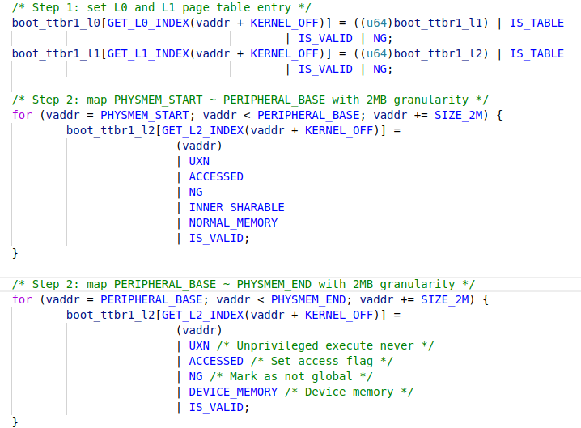
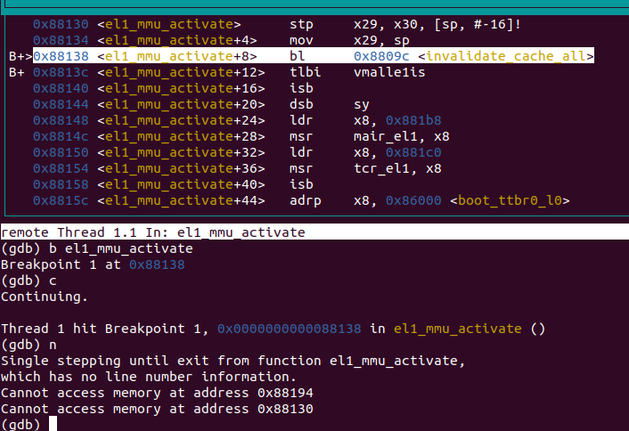
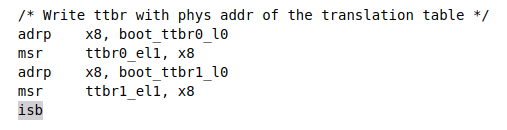

# `OS-Lab2`实验报告

- 思考题1：请思考多级页表相比单级页表带来的优势和劣势（如果有的话），并计算在` AArch64` 页表中分别以 `4KB` 粒度和` 2MB` 粒度映射` 0～4GB` 地址范围所需的物理内存大小（或页表页数量）。

- **回答1**：

  多级页表的优势：允许页表中存在空洞，从而极大地减少了页表占用的内存空间的大小。

  多级页表的劣势：多级页表允许大页，可能存在内存使用不充分的情况，即可能会导致比较严重的内部碎片问题。

  以`4KB`为粒度：总共需要`2^20`个**页表项**，由于以`4KB`为粒度的时候，页表的分级布局为`9+9+9+12`,所以，需要**一级页表2048个**，**二级页表4个**，**三级页表1个**，**四级页表1个**，所以共需要**页表页数为2054个**，所以需要的**物理内存空间大小为8.023`MB`**。

  以`2MB`为粒度：总共需要**页表项**2048个。所以需要**一级页表1个，二级页表2个**，所以需要的**页表页数为3个**，**物理内存空间为`6MB`**。

- 练习题 2：请在 `init_boot_pt` 函数的 `LAB 2 TODO 1` 处配置内核高地址页表（`boot_ttbr1_l0`、`boot_ttbr1_l1` 和 `boot_ttbr1_l2`），以` 2MB` 粒度映射。

- **回答2**：个人实现如下。其中`KERNEL_OFF`为自定义的一个宏，数值为`0XFFFFFF0000000000`,即`CHCore`中`kernel`的虚拟地址相对于物理地址的固定偏移量。

  

- 思考题 3：请思考在 `init_boot_pt` 函数中为什么还要为低地址配置页表，并尝试验证自己的解释。

- **回答3**：

  由于`ChCore`初始时是运行在低地址的，为了保证在启用`MMU`之后一些返回地址位于低地址的函数仍然能够正确映射地址并返回，我们需要为低地址也配置对应的页表。个人验证：移除对于低地址的页表配置部分(注释掉)，使用`GDB`运行，结果如下。可以看到，此时无法访问位于低地址区域的虚拟地址。

  

- 思考题 4：请解释 `ttbr0_el1` 与 `ttbr0_el1` 是具体如何被配置的，给出代码位置，并思考页表基地址配置后为何需要`ISB`指令。

- **回答4.1**：配置`ttbr0_el1`与`ttbr1_el1`的具体方式就是分别将`boot_ttbr0_l0`与`boot_ttbr1_l0`对应的`4KB`对齐的页的基地址传入`x8`寄存器中，在通过`x8`寄存器使用`msr`指令将上述数值传入`ttbr0_el1`与`ttbr1_el1`。

- **回答4.2**:`ISB`指令即是一种`memory barrier`,主要作用是保证指令的顺序执行。

- 代码位置:位于`tool.S`文件中`el1_mmu_activate`函数对应的汇编中。

  

- 练习题 5：完成 `kernel/mm/buddy.c` 中的 `split_page`、`buddy_get_pages`、`merge_page` 和 `buddy_free_pages` 函数中的 `LAB 2 TODO 2` 部分，其中 `buddy_get_pages` 用于分配指定阶大小的连续物理页，`buddy_free_pages` 用于释放已分配的连续物理页。

- **回答5**：

  1. **`split_page`**:实现思路是从当前`page`的`order`开始递归，若`page->order`仍然大于目标的`order`，则调用`get_buddy_chunk`来获取这个`page`在当前层的`buddy-page`，并将其放入这一层的空闲链表中。需要注意的是，由于这个提供的相关函数并不是真正切分这个`page`，而是通过`order`参数来确定当前块的大小，所以在进行每一次获取新的`buddy`之前，应该先将`page->order`减去1。函数的递归中止条件就是`page->order == order`。

     ```c
     static struct page *split_page(struct phys_mem_pool *pool, u64 order,
                                    struct page *page)
     {
             /* LAB 2 TODO 2 BEGIN */
             if (page->pool != pool) return NULL;
             if (page->order == order) return page;
             page->order -= 1;
             struct page* buddy_page = get_buddy_chunk(pool, page);
             buddy_page->order = page->order;
             buddy_page->allocated = 0;
             list_add(&(buddy_page->node), &((pool->free_lists[page->order]).free_list));
             (pool->free_lists[page->order]).nr_free++;
             return split_page(pool, order, page);
             /* LAB 2 TODO 2 END */
     }
     ```

  2. **`buddy_get_pages`**:基于`split_page`进行实现。具体思路是，首先从当前`order`层开始检查，找到第一层仍然有空余项的`free_list`，之后从其中取出一个空闲项，并将其从这个`free_list`中删除，如果找到这个空闲项的层数已经大于目标`order`，则需要进行`split_page`，否则不需要，需要注意的是，要将新分配的这个`page`的`allocated`属性设置为1。

     ```c
     struct page *buddy_get_pages(struct phys_mem_pool *pool, u64 order)
     {
             /* LAB 2 TODO 2 BEGIN */
             u64 cur = order;
             // find a list that has at least one free item.
             while(cur < BUDDY_MAX_ORDER && list_empty(&((pool->free_lists[cur]).free_list))) {
                     cur++;
             }
             if (cur >= BUDDY_MAX_ORDER) return NULL;
             struct list_head* node = ((pool->free_lists[cur]).free_list.next);
             list_del(node);
             // decrease the number of available items in the cur free_list.
             (pool->free_lists[cur]).nr_free--;
             struct page* tmp = list_entry(node, struct page, node);
             struct page* res = NULL;
             // if the allocated chunk is larger than the required one, split it here.
             if (cur != order) {
                     res = split_page(pool, order, tmp);
             }
             else res = tmp;
             res->allocated = 1;
             return res;
             /* LAB 2 TODO 2 END */
     }
     ```

  3. **`merge_page`**:从当前`page->order`开始递归，若当前层数小于层数上限，并且当前层的`buddy-page`不为空且仍然处于`free`状态，则合并这两个块，并将其从当前层删除。若上述条件不满足，则递归终止。需要注意的是，因为时要先检查当前层的`buddy`在合并，所以要先操作，在`page->order += 1`。并且新合并的`page`的起始地址(指针位置)应该是原始的`page`与`buddy`中较小的那一个，因为`get_buddy_chunk`函数并没有检查左右位置关系。

     ```c
     static struct page *merge_page(struct phys_mem_pool *pool, struct page *page)
     {
             /* LAB 2 TODO 2 BEGIN */
             if (page->order == BUDDY_MAX_ORDER - 1) return page;
             struct page* buddy = get_buddy_chunk(pool, page);
             if (buddy == NULL || buddy->allocated == 1) return page;
             if (buddy->order != page->order) return page;
             list_del(&(buddy->node));
             (pool->free_lists[buddy->order]).nr_free--;
             page = (page <= buddy) ? page : buddy;
             page->order++;
             return merge_page(pool, page);
             /* LAB 2 TODO 2 END */
     }
     ```

  4. **`buddy_free_pages`**:基于`merge_page`进行实现。先进行`merge_page`，之后将新生成的`merged-page`放入新的一层的`free_list`并修改空闲项数量即可。

     ```c
     void buddy_free_pages(struct phys_mem_pool *pool, struct page *page)
     {
             /* LAB 2 TODO 2 BEGIN */
             struct page* new_page = merge_page(pool, page);
             (pool->free_lists[new_page->order]).nr_free++;
             new_page->allocated = 0;
             list_add(&(new_page->node), &((pool->free_lists[new_page->order]).free_list));
             /* LAB 2 TODO 2 END */
     }
     ```

- 练习题 6：完成 `kernel/arch/aarch64/mm/page_table.c` 中的 `get_next_ptp`、 `query_in_pgtbl`、`map_range_in_pgtbl`、`unmap_range_in_pgtbl` 函数中的 `LAB 2 TODO 3` 部分，后三个函数分别实现页表查询、映射、取消映射操作，其中映射和取消映射以` 4KB` 页为粒度。

- **回答6**：

  1. **`get_next_ptp`**:

     ```c
     /* LAB 2 TODO 3 BEGIN */
     int order = 0; // try to allocate a new page start from order 0.
     // 利用kmalloc提供的get_pages接口分配一个新的页，order=0表示只会分配(1<<0)个页。
     new_ptp = get_pages(order);
     memset((void*) new_ptp, 0, PAGE_SIZE);
     //将新分配的页的起始地址转换为物理地址存入new_ptp_paddr.
     new_ptp_paddr = virt_to_phys((vaddr_t) new_ptp);
     new_pte_val.pte = 0;
     new_pte_val.table.is_table = 1; // set is_table
     new_pte_val.table.is_valid = 1; // set is_valid
     // 这里要右移12位，是因为这里的页以4KB为粒度，并且在结构体中next_table_addr需要占用36位。
     new_pte_val.table.next_table_addr = new_ptp_paddr >> 12; // set next_table_addr
     entry->pte = new_pte_val.pte;
     /* LAB 2 TODO 3 END */
     ```

  2. **`query_in_pgtbl`**:

     ```c
     int query_in_pgtbl(void *pgtbl, vaddr_t va, paddr_t *pa, pte_t **entry)
     {
             ptp_t* cur_ptp = (ptp_t*) pgtbl;
             ptp_t* next_ptp_0;
             ptp_t* next_ptp_1;
             ptp_t* next_ptp_2;
             ptp_t* next_ptp_3;
             pte_t* pte;
             // 首先利用L0页表查询当前VM在L1对应的页表项信息。
         	//主要这里最后一个参数是false，是因为这里只是进行查询，所以在发现没有对应映射的时候应该			//直接返回而不是创建新的。
             int res0 = get_next_ptp(cur_ptp, 0, va, &next_ptp_0, &pte, false);
             if (res0 == -ENOMAPPING) return -ENOMAPPING;
             // 利用L1页表查询当前VM在L2对应的页表项信息。
             int res1 = get_next_ptp(next_ptp_0, 1, va, &next_ptp_1, &pte, false);
             if (res1 == -ENOMAPPING) return -ENOMAPPING;
             if (res1 == BLOCK_PTP) {
                     //若是BLOCK_PTP，说明这个L1页表项不再是一个中间项，而是一个最终的大页项，直接				 //结束查询。
                 	//GET_LX_INDEX用于获取LX层一个VA的索引位置，即PTE的下标。
                 	//GET_VA_OFFSET_LX用于获取地址的偏移量，要区分这两个区别!
                     if (entry != NULL) *entry = pte;
                     paddr_t res1_addr = virt_to_phys(next_ptp_1) + GET_VA_OFFSET_L1(va);
                     *pa = res1_addr;
                     return 0;
             }
             // 利用L2页表查询当前VM在L3对应的页表项信息。
             int res2 = get_next_ptp(next_ptp_1, 2, va, &next_ptp_2, &pte, false);
             if (res2 == -ENOMAPPING) return -ENOMAPPING;
             if (res2 == BLOCK_PTP) {
                     // 与之前的1GB情况类似，处理2MB大页的特殊情况。
                     if (entry != NULL) *entry = pte;
                     paddr_t res2_addr = virt_to_phys(next_ptp_2) + GET_VA_OFFSET_L2(va);
                     *pa = res2_addr;
                     return 0;
             }
             int res3 = get_next_ptp(next_ptp_2, 3, va, &next_ptp_3, &pte, false);
         	//若已经查询到L3页表，那么查询结果只有两种可能：一个就是没找到对应映射，一个是找到了映		 //射，并且这个映射只能是一个PTE对应一个最终的data_page。(没有下一级了)
             if (res3 == -ENOMAPPING) return -ENOMAPPING;
             if (entry != NULL) *entry = pte;
             *pa = virt_to_phys(next_ptp_3) + GET_VA_OFFSET_L3(va);
             return 0;
     }
     ```

  3. **`map_range_in_pgtbl`**:

     ```c
     int map_range_in_pgtbl(void *pgtbl, vaddr_t va, paddr_t pa, size_t len,
                            vmr_prop_t flags)
     {
     //主要逻辑实际上与query函数类似。但是由于这个函数是要创建新的映射关系，所以			get_next_ptp最后一个参数要设置为true。另外，由于是要创建新的映射关系，所以只需要查询到L2就行了，并将新的L3的映射关系填入L3级页表中，而不需要再查询一次L3页表。
             size_t num = 0;
             if (len % PAGE_SIZE == 0) num = len / PAGE_SIZE;
             else num = len / PAGE_SIZE + 1;
             for (size_t i = 0; i < num; ++i) {
                     ptp_t* cur_ptp = (ptp_t*) pgtbl;
                     ptp_t* next_ptp_0;
                     ptp_t* next_ptp_1;
                     ptp_t* next_ptp_2;
                     ptp_t* next_ptp_3;
                     pte_t* pte;
                     int res0 = get_next_ptp(cur_ptp, 0, va, &next_ptp_0, &pte, true);
                     int res1 = get_next_ptp(next_ptp_0, 1, va, &next_ptp_1, &pte, true);
                     int res2 = get_next_ptp(next_ptp_1, 2, va, &next_ptp_2, &pte, true);
                     pte_t new_pte;
                     new_pte.pte = 0;
                     //因为这是最小粒度的4KB页，所以地址存储36位的，所以要右移12位。
                     new_pte.l3_page.pfn = pa >> 12;
                     new_pte.l3_page.is_page = 1;
                     new_pte.l3_page.is_valid = 1;
                     set_pte_flags(&new_pte, flags, USER_PTE);
                     next_ptp_2->ent[GET_L3_INDEX(va)].pte = new_pte.pte;
                     va += PAGE_SIZE;
                     pa += PAGE_SIZE;
             }
             return 0;
     }
     ```

  4. **`unmap_range_in_pgtbl`**:

     ```c
     int unmap_range_in_pgtbl(void *pgtbl, vaddr_t va, size_t len)
     {
             int num = 0;
             if (len % PAGE_SIZE == 0) num = len / PAGE_SIZE;
             else num = len / PAGE_SIZE + 1;
             for (size_t i = 0; i < num; ++i) {
                     ptp_t* cur_ptp = (ptp_t*) pgtbl;
                     ptp_t* next_ptp_0;
                     ptp_t* next_ptp_1;
                     ptp_t* next_ptp_2;
                     ptp_t* next_ptp_3;
                     pte_t* pte;
                 	//最后一个参数是false，是因为在消除映射的过程中不需要创建新的映射。
                     int res0 = get_next_ptp(cur_ptp, 0, va, &cur_ptp, &pte, false);
                     int res1 = get_next_ptp(cur_ptp, 1, va, &cur_ptp, &pte, false);
                     int res2 = get_next_ptp(cur_ptp, 2, va, &cur_ptp, &pte, false);
                 	//查询到L3页表项之后，直接将L3对应索引的PTE设置为INVALID即可，而不需要再查询				  //L3页表去获取真正的page。
                     cur_ptp->ent[GET_L3_INDEX(va)].pte = 0;
                     va += PAGE_SIZE;
             }
             return 0;
     }
     ```

- 练习题 7：完成 `kernel/arch/aarch64/mm/page_table.c` 中的 `map_range_in_pgtbl_huge` 和 `unmap_range_in_pgtbl_huge` 函数中的 `LAB 2 TODO 4` 部分，实现大页（`2MB、1GB` 页）支持。

- **回答7**：

  1. **`map_range_in_pgtbl_huge`**:

     ```C
     //这个函数的处理逻辑是:由于要同时支持1GB,2MB两种大页，所以做法是“从大到小”进行分配。即先根据1GB block来映射一部分地址，在通过2MB block来映射一部分页，最后剩余部分(即不足1GB与2MB的)直接用最小的4KB page进行映射。
     int map_range_in_pgtbl_huge(void *pgtbl, vaddr_t va, paddr_t pa, size_t len,
                                 vmr_prop_t flags)
     {
             u64 size1 = PAGE_SIZE * PTP_ENTRIES * PTP_ENTRIES;
             u64 num1 = len / size1;
             for (int i = 0; i < num1; ++i) {
                     ptp_t* cur_ptp = (ptp_t*) pgtbl;
                     pte_t* pte;
                 	//查询L0获取L1页表项。
                     int res0 = get_next_ptp(cur_ptp, 0, va, &cur_ptp, &pte, true);
                     pte_t new_pte;
                     new_pte.pte = 0;
                     new_pte.l1_block.is_table = 0;
                     new_pte.l1_block.is_valid = 1;
                 	//注意这里是1GB页，所以地址应该存储的是18位的，使用GET_L1_INDEX
                     new_pte.l1_block.pfn = pa >> 30;
                     set_pte_flags(&new_pte, flags, USER_PTE);
                     cur_ptp->ent[GET_L1_INDEX(va)].pte = new_pte.pte;
                     va += size1;
                     pa += size1;
             }
             len -= num1 * size1;
             u64 size2 = PAGE_SIZE * PTP_ENTRIES;
             u64 num2 = len / size2;
             for (int i = 0; i < num2; ++i) {
                     ptp_t* cur_ptp = (ptp_t*) pgtbl;
                     ptp_t* next_ptp_0;
                     ptp_t* next_ptp_1;
                     pte_t* pte;
                 	//查询L0获取L1页表项。
                     int res0 = get_next_ptp(cur_ptp, 0, va, &cur_ptp, &pte, true);
                 	//查询L1获取L2页表项。
                     int res1 = get_next_ptp(cur_ptp, 1, va, &cur_ptp, &pte, true);
                     pte_t new_pte;
                     new_pte.pte = 0;
                     new_pte.l2_block.is_table = 0;
                     new_pte.l2_block.is_valid = 1;
                 	//由于是2MB大页，所以地址存储27位的，并且使用GET_L2_INDEX.
                     new_pte.l2_block.pfn = pa >> 21;
                     set_pte_flags(&new_pte, flags, USER_PTE);
                     cur_ptp->ent[GET_L2_INDEX(va)].pte = new_pte.pte;
                     va += size2;
                     pa += size2;
             }
             len -= num2 * size2;
         	//L3层的映射直接复用之前实现的map_range_in_pgtbl函数。
             map_range_in_pgtbl(pgtbl, va, pa, len, flags);
             return 0;
     }
     ```

  2. **`unmap_range_in_pgtbl_huge`**:

     ```c
     //这个函数由于需要支持两种大页的情况，所以处理逻辑是，在进行unmap，不再是查询到L3在进行unmap，而是在查到L1与L2页表项的时候，如果发现是BLOCK_PTP(即不是中间页表项而是最终的大页数据项)，则也要进行相应的unmap操作。
     int unmap_range_in_pgtbl_huge(void *pgtbl, vaddr_t va, size_t len)
     {
             u64 num = 0;
             if (len % PAGE_SIZE == 0) num = len / PAGE_SIZE;
             else num = len / PAGE_SIZE + 1;
         	u64 i = 0;
             for (i = 0; i < num; ++i) {
                     ptp_t* cur_ptp = (ptp_t*) pgtbl;
                     pte_t* pte;
                     int res0 = get_next_ptp(cur_ptp, 0, va, &cur_ptp, &pte, false);
                 	u64 num1 = PTP_ENTRIES * PTP_ENTRIES * PTP_ENTRIES;
                     if (res0 == -ENOMAPPING) {
                             i += num1;
                         	i--;
                             va += num1 * PAGE_SIZE;
                             continue;
                     }
                     int res1 = get_next_ptp(cur_ptp, 1, va, &cur_ptp, &pte, false);
                 	u64 num2 = PTP_ENTRIES * PTP_ENTRIES;
                     if (res1 == -ENOMAPPING) {
                             i += num2;
                         	i--;
                             va += num2 * PAGE_SIZE;
                             continue;
                     }
                     if (res1 == BLOCK_PTP) {
                             i += num2;
                         	i--;
                             va += num2 * PAGE_SIZE;
                             pte->pte = 0;
                             continue;
                     }
                     int res2 = get_next_ptp(cur_ptp, 2, va, &cur_ptp, &pte, false);
                 	u64 num3 = PTP_ENTRIES;
                     if (res2 == -ENOMAPPING) {
                             i += num3;
                         	i--;
                             va += num3 * PAGE_SIZE;
                             continue;
                     }
                     if (res2 == BLOCK_PTP) {
                             i += num3;
                         	i--;
                             va += num3 * PAGE_SIZE;
                             pte->pte = 0;
                             continue;
                     }
                     cur_ptp->ent[GET_L3_INDEX(va)].pte = 0;
                     va += PAGE_SIZE;
             }
             return 0;
     }
     ```

- 思考题 8：阅读 Arm Architecture Reference Manual，思考要在操作系统中支持写时拷贝（Copy-on-Write，`CoW`）[^cow]需要配置页表描述符的哪个/哪些字段，并在发生缺页异常（实际上是 permission fault）时如何处理。

- **回答8**：

  1. 需要设置的字段是页表描述符中**当前页是否可以写入的权限位**。
  2. 写时拷贝允许两个程序共享一段物理内存(即不同的虚拟地址映射到同一个物理地址)，**但是这种共享是只读的**，在其中的一个程序要修改这段物理地址上面的内容的时候，会触发`permission fault`,在触发之后，`OS`会将触发异常的那部分共享内存拷贝一份到不同的物理地址中，并将这新拷贝出来的物理地址再次映射给要进行写操作的那个进程，并且这个新的映射出来的页**同时具有读权限与写权限**。

- 思考题 9：为了简单起见，在` ChCore` 实验中没有为内核页表使用细粒度的映射，而是直接沿用了启动时的粗粒度页表，请思考这样做有什么问题。

- **回答9**：

  1. 直接使用粗粒度的大页，使得物理内存的浪费加剧，并且可能导致很严重的碎片化问题。
  2. 直接使用粗粒度的大页，很难对于页的权限位进行更细粒度的控制。

- 挑战题 10：使用前面实现的 `page_table.c` 中的函数，在内核启动后重新配置内核页表，进行细粒度的映射。

- **回答10**：主要函数如下。

  ```c
  void reconfig_page_table() {
          vmr_prop_t flags_0 = VMR_READ | VMR_WRITE | VMR_EXEC;
          vmr_prop_t flags_1 = VMR_READ | VMR_WRITE | VMR_DEVICE | VMR_EXEC;
          size_t len_0 = 0x3f000000;
          size_t len_1 = 0x80000000 - 0x3f000000;
          int order = 0;
          void* pgtbl0 = get_pages(order);
          // 重新配置normal-memory部分的粒度。
          int ret_0 = map_range_in_pgtbl(pgtbl0, KERNEL_OFFSET, 0, len_0, flags_0);
          void* pgtbl1 = get_pages(order);
          // 重新配置device部分的页表粒度
          int ret_1 = map_range_in_pgtbl(pgtbl1, KERNEL_OFFSET + len_0, len_0, len_1, 		flags_1);
  }
  ```

- 
