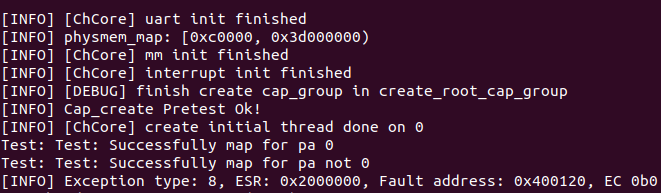
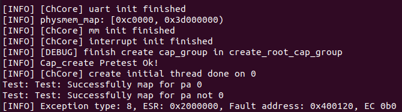

# `Lab3`实验报告

- 思考题 1: 内核从完成必要的初始化到用户态程序的过程是怎么样的？尝试描述一下调用关系。

- **回答1**：

  根据`Lab1,2`逻辑可以知道，完成必要初始化之后会通过汇编代码跳转到`main`函数继续执行。在`main`函数中，会通过调用`uart_init`和`mm_init`函数来再次初始化`uart`并开启`MMU`。之后通过`create_root_thread`来创建初始的一个用户态线程，创建完成之后，通过`switch_context()`函数来进行地址空间的切换,之后通过`eret_to_thread`从`kernel`态跳转到用户态的初始线程来继续执行。

- 练习题 2: 在 `kernel/object/cap_group.c` 中完善 `cap_group_init`、`sys_create_cap_group`、`create_root_cap_group` 函数。在完成填写之后，你可以通过 Cap create pretest 测试点。**注意通过这里的测试并不代表完全实现正确，后续在实验 4 中会再次测试这一部分。**

- **回答2**：实现如下。主要思路是结合`obj_alloc`,`cap_group_init`,`alloc_slot_id`等函数来进行要求的初始化工作。

  ```c++
  int cap_group_init(struct cap_group *cap_group, unsigned int size, u64 pid)
  {
          struct slot_table *slot_table = &cap_group->slot_table;
      	//初始化slot_table
          int r = slot_table_init(slot_table, size);
          if (r < 0) return r;
      	//设置新创建的cap_group的必要属性
          cap_group->pid = pid;
          cap_group->thread_cnt = 0;
          init_list_head(&(cap_group->thread_list));
          return 0;
  }
  
  int sys_create_cap_group(u64 pid, u64 cap_group_name, u64 name_len, u64 pcid)
  {
  		......
          /* LAB 3 TODO BEGIN */
          /* cap current cap_group */
          //首先创建一个cap_group类型的object。
          new_cap_group = obj_alloc(TYPE_CAP_GROUP, sizeof(struct cap_group));
          /* LAB 3 TODO END */
  		......
          /* LAB 3 TODO BEGIN */
          // 初始化，初始化的对象size注意要使用BASE_OBJECT_NUM。
          cap_group_init(new_cap_group, BASE_OBJECT_NUM, pid);
          /* LAB 3 TODO END */
  		......
          /* 2st cap is vmspace */
          /* LAB 3 TODO BEGIN */
          // 创建一个新的object用于表示一个vmspace。
          vmspace = obj_alloc(TYPE_VMSPACE, sizeof(struct vmspace));
          /* LAB 3 TODO END */
          ......
  }
  
  struct cap_group *create_root_cap_group(char *name, size_t name_len)
  {
          ......
          /* LAB 3 TODO BEGIN */
          // 创建object并初始化这个cap_group。
          // 注意这个函数是创建root process，所以pid = 1.
          // refcount = 1是因为root线程在刚被创建的时候就会被调用。
          struct object* obj = obj_alloc(TYPE_CAP_GROUP, sizeof(struct cap_group));
          obj->refcount = 1;
          cap_group = obj->opaque;
          int cap = cap_group_init(cap_group, BASE_OBJECT_NUM, 1);
          if (cap < 0) return NULL;
          /* LAB 3 TODO END */
          ......
          /* LAB 3 TODO BEGIN */
          // 为新创建的cap_group分配slot_id,成功的话数值应该为0.
          slot_id = alloc_slot_id(cap_group);
          /* LAB 3 TODO END */
          ......
          /* LAB 3 TODO BEGIN */
          // 在新分配的slot id对应索引位置填充根据cap_group来创建的object slot。
          struct object_slot* slot0 = kmalloc(sizeof(struct object_slot));
          slot0->slot_id = slot_id;
          slot0->cap_group = cap_group;
          slot0->object = obj;
          slot0->isvalid = 1;
          // slot0->rights = 0;
          init_list_head(&(slot0->copies));
          // install_slot(cap_group, slot_id, slot0);
          cap_group->slot_table.slots[slot_id] = slot0;
          kinfo("[DEBUG] finish create cap_group in create_root_cap_group\n");
  
          vmspace = obj_alloc(TYPE_VMSPACE, sizeof(struct vmspace));
          /* LAB 3 TODO END */
          ......
          /* LAB 3 TODO BEGIN */
          // 根据代码提供的提示注释，pcid应该设置为1.
          vmspace_init(vmspace);
          vmspace->pcid = 1;
      	// 分配slot id，成功的话应该结果为1.
          slot_id = cap_alloc(cap_group, vmspace, 0);
          /* LAB 3 TODO END */
          ......
          return cap_group;
  }
  ```

- 练习题 3: 在 `kernel/object/thread.c` 中完成 `load_binary` 函数，将用户程序 ELF 加载到刚刚创建的进程地址空间中。

- **回答3**：实现如下。其中，`seg_sz`表示的是某一个程序段的原始大小，`seg_map_sz`表示的是这个程序段需要映射的大小，可能不等于`seg_sz`是因为这个`segment`的起始地址可能在某一个`page`的中间，即不会沾满整个`page`,但是映射的时候需要分配整个`page`。`p_vaddr`表示的`segment`对应的起始虚拟地址。

  ```c
  static u64 load_binary(struct cap_group *cap_group, struct vmspace *vmspace,
                         const char *bin, struct process_metadata *metadata)
  {
  ......
          /* load each segment in the elf binary */
          for (i = 0; i < elf->header.e_phnum; ++i) {
                  pmo_cap[i] = -1;
                  if (elf->p_headers[i].p_type == PT_LOAD) { 
                          seg_sz = elf->p_headers[i].p_memsz;
                          p_vaddr = elf->p_headers[i].p_vaddr;
                          /* LAB 3 TODO BEGIN */
                          size_t tmp = p_vaddr + seg_sz;
                      	// 计算seg_map_sz.
                          size_t map_sz_1 = ROUND_UP(tmp, PAGE_SIZE);
                          size_t map_sz_2 = ROUND_DOWN(p_vaddr, PAGE_SIZE);
                          seg_map_sz = map_sz_1 - map_sz_2;
                      	// 根据要映射的大小创建对应的物理内存对象pmo，
                      	// 这里的PMO_DATA 表示的是直接映射，即创建之后就进行映射
                          int got = create_pmo(seg_map_sz, PMO_DATA, cap_group, &pmo);
                          pmo_cap[i] = got;
                      	// 此处是load的核心，即将elf file对应部分放到对应的虚拟地址位置上去
                          void* start_pos = (void*)phys_to_virt(pmo->start) + (p_vaddr & OFFSET_MASK);
                          memcpy(start_pos, bin + elf->p_headers[i].p_offset, elf->p_headers[i].p_filesz);
                          // generate vmr flags.
                          flags = PFLAGS2VMRFLAGS(elf->p_headers[i].p_flags);
                      	// 通过vmspace_map_range函数完成地址映射。
                          ret = vmspace_map_range(vmspace, p_vaddr, seg_map_sz, flags, pmo);
                          /* LAB 3 TODO END */
                          BUG_ON(ret != 0);
                  }
          }
  ......
  }
  ```

- 练习题 4: 按照前文所述的表格填写 `kernel/arch/aarch64/irq/irq_entry.S` 中的异常向量表，并且增加对应的函数跳转操作。

- **回答4**：实现如下。

  ```assembly
  EXPORT(el1_vector)
  /* LAB 3 TODO BEGIN */
  /* 顺序参考提供的lab文档，因为涉及到地址问题，所以只能是来看顺序不要弄错。*/
  	exception_entry sync_el1t
  	exception_entry irq_el1t
  	exception_entry fiq_el1t
  	exception_entry error_el1t
  
  	exception_entry sync_el1h
  	exception_entry irq_el1h
  	exception_entry fiq_el1h
  	exception_entry error_el1h
  
  	exception_entry sync_el0_64
  	exception_entry irq_el0_64
  	exception_entry fiq_el0_64
  	exception_entry error_el0_64
  
  	exception_entry sync_el0_32
  	exception_entry irq_el0_32
  	exception_entry fiq_el0_32
  	exception_entry error_el0_32
  /* LAB 3 TODO END */
  ```

- 练习题 5: 填写 `kernel/arch/aarch64/irq/pgfault.c` 中的 `do_page_fault`，需要将缺页异常转发给 `handle_trans_fault` 函数。

- **回答5**：实现如下。

  ```c
  void do_page_fault(u64 esr, u64 fault_ins_addr)
  {
          ......
          switch (fsc) {
          case DFSC_TRANS_FAULT_L0:
          case DFSC_TRANS_FAULT_L1:
          case DFSC_TRANS_FAULT_L2:
          case DFSC_TRANS_FAULT_L3: {
                  int ret;
                  /* LAB 3 TODO BEGIN */
                  handle_trans_fault(current_thread->vmspace, fault_addr);
                  /* LAB 3 TODO END */
                  ......
          }
          ......
  }
  ```

- 练习题 6: 填写 `kernel/mm/pgfault_handler.c` 中的 `handle_trans_fault`，实现 `PMO_SHM` 和 `PMO_ANONYM` 的按需物理页分配。

- **回答6**：实现如下。根据文档提示可以知道，`PMO_ANONYM`与`PMO_SHM`是按需分配页的，所以有在发生缺页的时候此页还没有被分配的可能。所以，在没有被分配的时候，需要先分配一个新的`page`并进行映射**并通过`commit_page_to_pmo`函数提交新创建的并且已经映射的页。**如果发生缺页的时候对应页已经被映射过了，那么直接修改其映射关系就可以了。

  ```c
  int handle_trans_fault(struct vmspace *vmspace, vaddr_t fault_addr)
  {
  		......
          switch (pmo->type) {
          case PMO_ANONYM:
          case PMO_SHM: {
  				......
                  /* LAB 3 TODO BEGIN */
                  pa = get_page_from_pmo(pmo, index);
                  /* LAB 3 TODO END */
                  if (pa == 0) {
                          /* Not committed before. Then, allocate the physical
                           * page. */
                          /* LAB 3 TODO BEGIN */
                          void* new_page = get_pages(0);
                          pa = virt_to_phys(new_page);
                          // create new mapping relation.
                          commit_page_to_pmo(pmo, index, pa);
                          map_range_in_pgtbl(vmspace->pgtbl, fault_addr, pa, PAGE_SIZE, perm);
                          /* LAB 3 TODO END */
  		......
                  } else {
                          /* LAB 3 TODO BEGIN */
                          map_range_in_pgtbl(vmspace->pgtbl, fault_addr, pa, PAGE_SIZE, perm);
                          /* LAB 3 TODO END */
  		......
                  }
  		......
  }
  
  ```

  

- 练习题 7: 按照前文所述的表格填写 `kernel/arch/aarch64/irq/irq_entry.S` 中的 `exception_enter` 与 `exception_exit`，实现上下文保存的功能。

- **回答7**：实现如下，此部分主要参考`PPT`讲过的内容，但是要注意，**根据`registers.h`中提供的信息可以知道，么一个寄存器在存入的时候占据的空间为8个字节，而不是课件上面讲的16**。

  ```assembly
  .macro	exception_enter
  	sub sp, sp, #ARCH_EXEC_CONT_SIZE
  	stp x0, x1, [sp, #8 * 0]
  	stp x2, x3, [sp, #8 * 2]
  	stp x4, x5, [sp, #8 * 4]
  	stp x6, x7, [sp, #8 * 6]
  	stp x8, x9, [sp, #8 * 8]
  	stp x10, x11, [sp, #8 * 10]
  	stp x12, x13, [sp, #8 * 12]
  	stp x14, x15, [sp, #8 * 14]
  	stp x16, x17, [sp, #8 * 16]
  	stp x18, x19, [sp, #8 * 18]
  	stp x20, x21, [sp, #8 * 20]
  	stp x22, x23, [sp, #8 * 22]
  	stp x24, x25, [sp, #8 * 24]
  	stp x26, x27, [sp, #8 * 26]
  	stp x28, x29, [sp, #8 * 28]
  	......
  	stp x30, x21, [sp, #8 * 30]
  	stp x22, x23, [sp, #8 * 32]
  .endm
  
  .macro	exception_exit
  	ldp x22, x23, [sp, #8 * 32]
  	ldp x30, x21, [sp, #8 * 30]
  	......
  	ldp x28, x29, [sp, #8 * 28]
  	ldp x26, x27, [sp, #8 * 26]
  	ldp x24, x25, [sp, #8 * 24]
  	ldp x22, x23, [sp, #8 * 22]
  	ldp x20, x21, [sp, #8 * 20]
  	ldp x18, x19, [sp, #8 * 18]
  	ldp x16, x17, [sp, #8 * 16]
  	ldp x14, x15, [sp, #8 * 14]
  	ldp x12, x13, [sp, #8 * 12]
  	ldp x10, x11, [sp, #8 * 10]
  	ldp x8, x9, [sp, #8 * 8]
  	ldp x6, x7, [sp, #8 * 6]
  	ldp x4, x5, [sp, #8 * 4]
  	ldp x2, x3, [sp, #8 * 2]
  	ldp x0, x1, [sp, #8 * 0]
  	add sp, sp, #ARCH_EXEC_CONT_SIZE
  	eret
  .endm
  ```

- 此处额外附上运行`badinst1.bin`与`badinst2.bin`的结果截图。

  `badinst1.bin`:

  

  `badinst2.bin`:

  

- 思考题 8： `ChCore`中的系统调用是通过使用汇编代码直接跳转到`syscall_table`中的 相应条目来处理的。请阅读`kernel/arch/aarch64/irq/irq_entry.S`中的代码，并简要描述`ChCore`是如何将系统调用从异常向量分派到系统调用表中对应条目的。

- **回答8**：

  主要在`el0_syscall`函数中实现。在发生`sync_el0_64`类型的`exception`的时候，汇编代码会跳转到`el0_syscall`函数中继续执行。在这个函数中，会先找到`syscall_table`的基地址，并根据存储与`x16`中的要调用的`syscall`的编号直接跳转到`syscall_table`的对应条目位置开始执行。

  ```assembly
  	adr	x27, syscall_table		// syscall table in x27
  	uxtw	x16, w8				// syscall number in x16
  	ldr	x16, [x27, x16, lsl #3]		// find the syscall entry
  	blr	x16
  ```

- 练习题 9: 填写 `kernel/syscall/syscall.c` 中的 `sys_putc`、`sys_getc`，`kernel/object/thread.c` 中的 `sys_thread_exit`，`libchcore/include/chcore/internal/raw_syscall.h` 中的 `__chcore_sys_putc`、`__chcore_sys_getc`、`__chcore_sys_thread_exit`，以实现 `putc`、`getc`、`thread_exit` 三个系统调用。

- **回答9**：实现如下。

  `kernel/syscall/syscall.c`:

  ```c
  // 直接调用uart提供的接口(lab1)
  void sys_null_placeholder(long arg)
  {
          BUG("Invoke non-implemented syscall\n");
  }
  
  void sys_putc(char ch)
  {
          /* LAB 3 TODO BEGIN */
          // not sure here.
          // call uart APIs diectly?
          uart_send((u32) ch);
          /* LAB 3 TODO END */
  }
  ```

  `kernel/object/thread.c`:(需要注意在设置`TS_EXIT`之后需要将当前`thread`设置为`NULL`因为当前线程已经退出了，因此不应该在下一个`thread`被调度之前不应该在能够访问旧的`current_thread`。)

  ```C
  void sys_thread_exit(void)
  {
  #ifdef CHCORE_LAB3_TEST
          printk("\nBack to kernel.\n");
  #endif
          /* LAB 3 TODO BEGIN */
      	// 设置当前的thread的状态为exit的退出状态
          current_thread->thread_ctx->state = TS_EXIT;
          current_thread = NULL;
          /* LAB 3 TODO END */
          printk("Lab 3 hang.\n");
          while (1) {
          }
          /* Reschedule */
          sched();
          eret_to_thread(switch_context());
  }
  ```

  `libchcore/include/chcore/internal/raw_syscall.h`:需要注意的是此处的`__chcore_syscallX`与`RPC`调用格式类似，即第一个参数一定是类型，之后的参数才是要传入的实际参数。所以要注意`__chcore_sys_putc`要使用`syscall1`而不是`syscall0`。

  ```C
  static inline void __chcore_sys_putc(char ch)
  {
          /* LAB 3 TODO BEGIN */
          __chcore_syscall1(__CHCORE_SYS_putc, ch);
          /* LAB 3 TODO END */
  }
  
  static inline u32 __chcore_sys_getc(void)
  {
          u32 ret = -1;
          /* LAB 3 TODO BEGIN */
          ret = __chcore_syscall0(__CHCORE_SYS_getc);
          /* LAB 3 TODO END */
          return ret;
  }
  
  static inline void __chcore_sys_thread_exit(void)
  {
          /* LAB 3 TODO BEGIN */
          __chcore_syscall0(__CHCORE_SYS_thread_exit);
          /* LAB 3 TODO END */
  }
  ```

- 挑战题 10: 截止到现在由于没有磁盘，因此我们采用一部分内存模拟磁盘。内存页是可以换入换出的，请设计一套换页策略（如` LRU` 等），并在 `kernel/mm/pgfault_handler.c` 中的 `handle_trans_fault` 实现你的换页方法。

- **回答10**：

  实现了**`LRU`**换页机制。
  
  使用的结构体：
  
  ```c
  struct v_node {
          struct list_head node;
          struct vmregion* vmr;
          int idx;
  };
  
  struct lru_node {
      	// 维护一个lru结点的链表，每有一个新的page被访问/被映射，将其添加到链表最后，在swap时移除链表头部的节点
          struct list_head node;
      	// idx表示链表的索引信息，用于在运行时钟算法的时候表示其在链表中的位置，便于swap对应节点
          int idx;
      	//当前的lru节点对应的vaddr信息
          struct v_node* vaddr;
  };
  ```
  
  主要思路：
  
  主要分为**`pa == 0`**与**`pa != 0`**两种情况。
  
  `pa == 0`:
  
  1. 由于还没有分配对应的物理页，所以要先检查当前的`LRU`队列是否已经满了，
  2. 如果已经满了，那么就要换出当前位于队列头部的页。(`lru_head->node.next`)。
  3. 如果没有满，那么就需要重新分配一个新的物理页，并将其添加到`LRU`队列尾部，
  4. 通过`commit_page_to_pmo`来将新创建的物理页添加到对应的物理内存对象中(实际上这里就是将这个新的映射关系存储在对应的物理内存对象中)。
  5. 在`fault_addr`(一个虚拟地址)与新分配的物理页对应的物理地址进行映射即可。
  6. 对于最开始提到的需要换出一个页的情况，在换出之后也需要进行上述操作。
  
  `pa != 0`:
  
  1. 由于已经分配了对应的物理页，所以存在映射到的物理页**已经被换出**和**还没有被换出(留在`LRU`队列中)**两种情况。
  2. 对于已经被换出的情况：
     1. 需要先在当前的`LRU`队列中找到一个空余位置用于将这个页在换回来。
     2. 如果此时队列未满，则直接选取一个空余位置即可。
     3. 如果已经满了，那么就需要换出队列头部的页。
     4. 将目标的曾经被换出的页添加到队列尾部(具体做法是，创建一个新的节点对象，将其添加到尾部，并将目标页对应的数据内容通过`memcpy`复制到这个新的节点对应的物理页位置。)
     5. 在`fault_addr`对应的虚拟页与这个新换回来的物理页之间添加映射关系。
  3. 对于未被换出的情况：
     1. 如果未被换出，那么首先需要找到这个要访问的触发`page_fault`的`pa`具体位于哪一个存储于`real_mem`的物理页中。
     2. 将要进行映射的虚拟页信息添加到这个物理页对应的`vaddr`列表中去(之所以是列表是因为是允许一个物理页对应多个虚拟页的)。
     3. 将这个刚刚被访问过的`real_mem`中的物理页添加到`LRU`队列的末尾。
     4. 在这个物理页与`fault_addr`对应的虚拟页之间建立映射关系。

- **注：挑战题虽实现了对应功能，但是还存在`BUG`没有解决，所以暂时处于禁用状态(`USE_LRU = 0`)**。